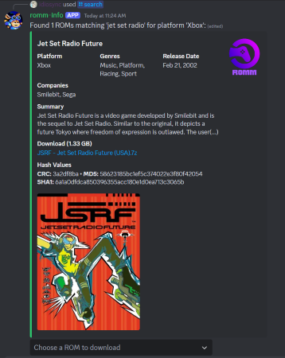

# RomM-ComM (RomM Communicator Module)

A Discord bot that integrates with the [RomM](https://github.com/rommapp/romm) API to provide information about your ROM collection.

## Features

Current
- Stats: Near real-time ROM collection statistics in voice channel, bot status and via command
- Search: Platform-specific ROM searches and random ROM roll that provide download link and game/file information
- Search: Platform based firmware search that lists firmware file information and provides download links
- Scans: Start/stop different types of RomM scans, report back with info about the scan when complete and also during a scan in progress via command
- Emojis: Custom game console emoji uploads upon bot installation, use of said emojis in bot responses and stats
- QR code generation: Install games on 3DS/Vita via QR code with apps like FBI/[FBI Reloaded](https://github.com/TheRealZora/FBI-Reloaded)/[VitaShell](https://github.com/RealYoti/VitaShell) (download endpoint auth must be disabled on RomM instance)
- Switch Shop Info: Command that lists instructions on how to connect to the [Tinfoil](https://tinfoil.io/Download) endpoint of connected RomM server (download endpoint auth must be disabled on RomM instance)
- Rate-limited Discord API interactions
- Caching system, the bot onnly fetches fresh stats if that particular stat has updated since last fetch

In Progress
- Request System: Make and manage ROM requests entirely in Discord

Planned (if possible)
- Generate and pass EmulatorJS launcher links via command
- Docker installation
- Linking Discord users with RomM users (creation of Romm users via role?)
- RomM API key usage so user/pass do not have to be passed (if RomM implements creating API key)
- Better IGDB integration (currently pulles IGDB cover url from RomM db entry for game)
- More robust request command that searches IGDB per platform and passes along requested game ID
- Look up most popular games (via RomM logs?) and provide stats via command

## Requirements

- Python 3.8+
- Pycord library
- aiohttp
- python-dotenv
- qrcode
- Pillow
- python-socketio
- requests
- aiosqlite

## Installation

1. Clone the repository or download the source code
2. Install required dependencies:
```bash
pip install py-cord aiohttp python-dotenv qrcode Pillow python-socketio requests aiosqlite
```
## Discord Bot Token Creation
- See https://docs.pycord.dev/en/stable/discord.html

## RomM Settings

1. If you want browser downloads to function for users without logging in and Switch shop/Qr code downloads
   to function on consoles, set Add '''DISABLE_DOWNLOAD_ENDPOINT_AUTH=true''' to your RomM environment variables.

## Configuration

Create a `.env` file in the root directory with the following variables:

```env
# Required Settings
TOKEN=your_discord_bot_token
GUILD=your_guild_id
API_URL=your_api_base_url
USER=api_username
PASS=api_password

# Optional Settings
DOMAIN=your_website_domain
SYNC_RATE=3600
REQUESTS_ENABLED=TRUE
UPDATE_VOICE_NAMES=true
CHANNEL_ID=your_channel_id
SHOW_API_SUCCESS=false
CACHE_TTL=300
API_TIMEOUT=10
```

### Configuration Details

#### Required Settings:
- `TOKEN`: Your Discord bot token
- `GUILD`: Discord server (guild) ID
- `API_URL`: Base URL for local Romm instance (http://ip:port)
- `USER`: API authentication username
- `PASS`: API authentication password

#### Optional Settings:
- `DOMAIN`: Website domain for any download links, can use local ip/port if not exposing RomM to the internet (default: "No website configured")
- `SYNC_RATE`: How often to sync with API in seconds (default: 3600)
- `UPDATE_VOICE_NAMES`: Enable/disable voice channel stats (default: true)
- `REQUESTS_ENABLED` : Enable request system (default: true)
- `SHOW_API_SUCCESS`: Show API sync result messages in Discord (default: false)
- `CHANNEL_ID`: Channel ID for API sync result messages notifications to be sent to (if enabled above)
- `CACHE_TTL`: Cache time-to-live in seconds (default: 300)
- `API_TIMEOUT`: API request timeout in seconds (default: 10)

## Available Commands

### /refresh
Manually update API data from RomM.

### /stats
Show current collection statistics.


### /platforms
Display all available platforms with their ROM counts.


### /search [platform] [game]
Search for ROMs by platform and game name. Provides:
- Interactive selection menu listing first 25 results
- Platform selection autofill (pulled from RomM's internal list of avalable platforms)
- File names
- File sizes
- Hash details (CRC, MD5, SHA1)
- Download links pointing to your public URL or IP if configured
- Cover images when available (if RomM's game entry is properly matched to an IGDB entry)
- React with the :qr_code: emoji and the bot will respond with a QR code for 3DS/Vita dowloads



### /random [platfom]*
- Finds random rom in your collection and displays info outlined in /search command
- *Platform input is optional, if not set it will grab a random rom from a random platform

### /firmware [platform]
List available firmware files for a specific platform. Shows:
- File names
- File sizes
- Hash details (CRC, MD5, SHA1)
- Download links pointing to your public URL or IP


### /scan [option]
Trigger RomM library scan. Options are:
- [platform] [platform name]: Scan a specific platform
- [full]: Perform a full system scan
- [stop]: Stop the current scan
- [status]: Check current scan status
- [unidentified]: Scan unidentified ROMs
- [hashes]: Update ROM hashes
- [new_platforms]: Scan new platforms only
- [partial]: Scan ROMs with partial metadata
- [summary]: View last scan summar


### Requests
- /request - Submit a new request
- /my_requests - View your requests
- /cancel_request - Cancel a pending request
- /toggle_requests - Administrators can toggle request system on/off
- /request_status - Users can check the status 
- /request_admin - Admin commands (list/fulfill/reject/addnote)

Request System Features:
- Users can submit ROM requests with platform, game name, and optional details
- Limit of 3 pending requests per user
- Users can view their own requests
- Users can cancel their pending requests
- Uses SQLite database to store requests

Admin Features:
- List all pending requests
- Fulfill or reject requests
- Add notes to requests
- DM notifications to users when their requests are fulfilled/rejected

Dababase Structure:
- Request ID
- User information
- Platform and game details
- Request status (pending/fulfilled/rejected/cancelled)
- Timestamps
- Admin notes and fulfillment details

## Visable Statistics

Voice Channel Stat Display
- If enabled (`UPDATE_VOICE_NAMES=true`), the bot creates voice channels displaying
  platform, rom, save, savestate, and screenshot count as well as RomM storage use size
- Only updates if stats change upon API refresh
- Right now it creates new channels and deletes the old, will soon edit instead
- I'm planning on making emoji's customizable and each VC toggalable individually


Bot "Now Playing" ROM count
- Lists number of ROMs as the bot's status
- Updates whenever API data is refreshed via timer or manually


## Error Handling

The bot includes comprehensive error handling and logging:
- API connection issues
- Rate limit management
- Discord API errors
- Data validation
- Cache management

## Cache System

Implements an efficient caching system:
- Configurable TTL (Time-To-Live)
- Automatic cache invalidation
- Memory-efficient storage
- Separate caching for different endpoints

## Security

- Basic authentication for API requests using http and websockets
- Environment variable configuration instead of storing passwors in code
- No sensitive data logging (passwords, etc)
- Proper permission checking

## Troubleshooting

- Check Discord bot token
- Verify bot permissions on Discord's end
- Check API connectivity to RomM
- Check logs for error messages, I tried to meticulously report errors
- Verify configuration settings in the env
