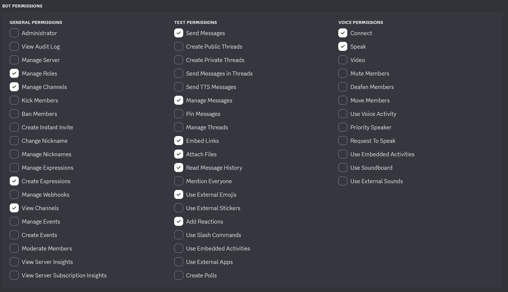
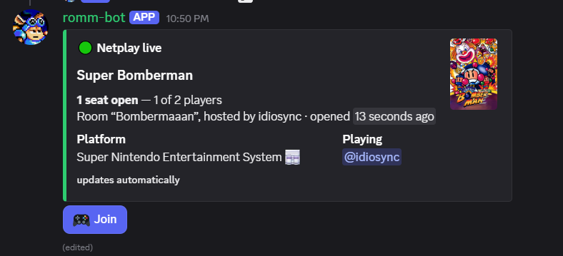
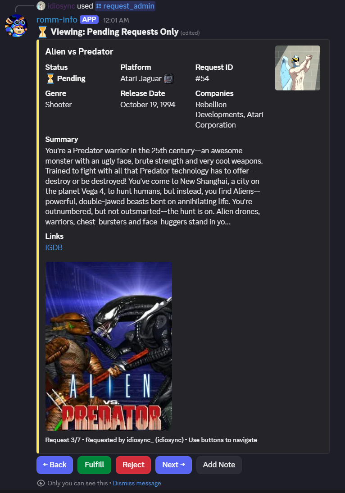
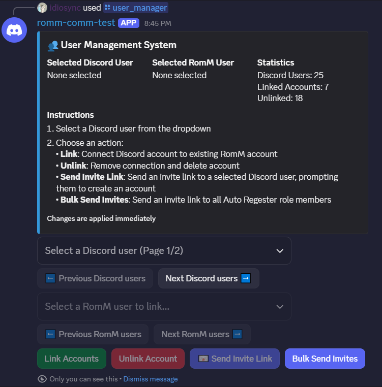
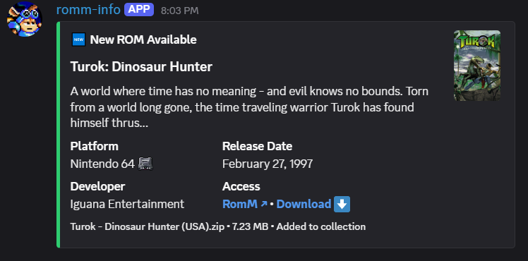

<div align="center">
  

  <h1>RomM-ComM</h1>
  <p><em>RomM Communicator Module: a Discord bot for your <a href="https://github.com/rommapp/romm">RomM</a> library.</em></p>

  <a href="https://github.com/idio-sync/romm-comm/actions/workflows/docker-image.yml"></a>
  <a href="https://hub.docker.com/r/idiosync000/romm-comm"></a>
  

  <br><br>
  
</div>

---

Search the collection, take requests, announce netplay sessions, hand out console
feed setup instructions, onboard users, and drive scans, all from Discord.

> Disclaimer: this was primarily created using Claude Code after my project scope
> outpaced my programming ability.

## Contents

[Quick start](#quick-start) · [Configuration](#configuration) · [Commands](#commands) ·
[Netplay](#netplay) · [Console feeds](#console-feeds) · [Requests](#requests) ·
[User manager](#user-manager) · [Recently added](#recently-added) ·
[Stats](#stats) · [Emojis](#emojis) · [Troubleshooting](#troubleshooting)

---

## What it does

| | |
|---|---|
| **Search** | Platform-scoped search, random roll, multi-file selection, firmware listings with hashes and download links. QR codes for 3DS/Vita installs by reacting to a `/search` result. |
| **Requests** | Submit and manage ROM requests from Discord, enriched with IGDB metadata, auto-filled on scan, with optional [GGRequestz](https://github.com/XTREEMMAK/ggrequestz) sync. |
| **Netplay** 🆕 | Announce a RomM netplay session; the embed tracks seats, host and players live and links people straight into the browser player. |
| **Console feeds** 🆕 | `/feeds` gives per-console setup steps for RomM's five URL feeds, offering only the consoles this server actually hosts. |
| **Leaderboards** 🆕 | `/ra-leaderboard` ranks your users by RetroAchievements progress, server-wide or per game. |
| **Recently added** | Posts new ROMs to a channel, batched and grouped by platform when a scan lands several at once. |
| **Stats** | Live collection stats in voice channel names, the bot's "Now Playing" status, and on demand. |
| **Users** | Auto-create RomM accounts from a Discord role, and link/unlink RomM ↔ Discord accounts from a GUI. |
| **Scans** | Start, stop and follow every RomM scan type, with progress and a completion summary. |
| **Emojis** | Uploads a console emoji set on install, expands it when the server has Nitro slots, and reverts cleanly when it doesn't. |

Planned: Matrix, Telegram and Slack clients (no ETA).

---

## Quick start

### Docker

```bash
docker pull idiosync000/romm-comm:latest
```

Pass the [environment variables](#configuration) and mount `/app/data` to a host
directory; it holds the user/request database and emoji sync state.

### Local

Python 3.12+:

```bash
pip install -r requirements.txt
python bot.py
```

### Discord bot setup

Follow the [Pycord guide](https://docs.pycord.dev/en/stable/discord.html) to create
the bot, then enable **Privileged Gateway Intents** and grant these permissions:

<p align="center"></p>

### RomM server settings

To let downloads work without users logging in (required for QR installs, and for
the console feed clients that fetch unauthenticated), set on your RomM server:

```env
DISABLE_DOWNLOAD_ENDPOINT_AUTH=true
```

---

## Configuration

Create a `.env` in the project root.

```env
# Required
TOKEN=your_discord_bot_token
GUILD=your_guild_id
API_URL=http://your_romm_host:port
ROMM_CLIENT_TOKEN=rmm_your_client_token   # or ROMM_USER / ROMM_PASS

# Commonly used
ADMIN_ID=admin_user_or_role_id
DOMAIN=https://your.public.romm.url
IGDB_CLIENT_ID=your_client_id
IGDB_CLIENT_SECRET=your_client_secret
AUTO_REGISTER_ROLE_ID=romm_users_role_id
CHANNEL_ID=your_channel_id
RECENT_ROMS_ENABLED=true
RECENT_ROMS_CHANNEL_ID=your_channel_id
```

### Required

| Variable | Description |
|---|---|
| `TOKEN` | Discord bot token. |
| `GUILD` | Discord server (guild) ID. |
| `API_URL` | Base URL of your RomM instance (`http://ip:port` or a domain). |
| `ROMM_CLIENT_TOKEN` | **Preferred** (RomM 4.8+). See below. |
| `ROMM_USER` / `ROMM_PASS` | Fallback when no client token is set. Legacy `USER` / `PASS` still work, but `USER` can collide with the OS username. |

**Client API token.** Create one in the RomM web UI under your profile →
**API Tokens** (or `POST /api/client-tokens`) with the scopes:

```
roms.read platforms.read firmware.read users.read users.write me.write assets.read
```

Create it as an admin, since scopes are capped by the creating user's permissions, and
the user-manager commands need `users.write`. `assets.read` is required by netplay;
tokens issued before it was added must be reissued.

### Optional

| Variable | Default | Description |
|---|---|---|
| `ADMIN_ID` | - | User **or** role ID allowed to run admin commands. |
| `DOMAIN` | `No website configured` | Public RomM URL used for download and netplay join links. |
| `SYNC_RATE` | `3600` | Seconds between API syncs. |
| `CACHE_TTL` | `3900` | Cache lifetime in seconds. |
| `API_TIMEOUT` | `30` | API request timeout in seconds. |
| `LOG_LEVEL` | `INFO` | Logging verbosity. |
| `UPDATE_VOICE_NAMES` | `true` | Voice channel stat displays. |
| `CHANNEL_ID` | - | Channel for sync results and user-manager logs. |
| `SHOW_API_SUCCESS` | `false` | Post API sync results to `CHANNEL_ID` (debugging). |
| `REQUESTS_ENABLED` | `true` | Request commands. |
| `IGDB_CLIENT_ID` / `IGDB_CLIENT_SECRET` | - | Request metadata; can be shared with RomM. |
| `ENABLE_USER_MANAGER` | `true` | User management module. |
| `AUTO_REGISTER_ROLE_ID` | - | Role that triggers automatic RomM invite DMs. |
| `RECENT_ROMS_ENABLED` | `true` | Recent-ROM posting. |
| `RECENT_ROMS_CHANNEL_ID` | - | Channel for recent-ROM notifications. |
| `RECENT_ROMS_MAX_PER_POST` | `10` | ROM rows shown per post. |
| `RECENT_ROMS_BULK_THRESHOLD` | `25` | Rows before collapsing to a platform summary. |
| `GGREQUESTZ_ENABLED` | `false` | Send requests to GGRequestz. |
| `GGREQUESTZ_URL` | - | GGRequestz base URL. |
| `GGREQUESTZ_API_KEY` | - | Needs the `requests:read`, `requests:write` and `games:read` scopes. GGRequestz denies unscoped routes with a 403 naming the missing scope; the bot logs that at first use, not at startup. |
| `NETPLAY_*` | - | See [Netplay](#netplay). |

---

## Commands

| Command | What it does |
|---|---|
| `/search [platform] [game]` | Interactive search results, multi-file selection, optional QR code for console installs. |
| `/random [platform]` | Roll a random ROM. |
| `/platforms` | Every platform with its ROM count. |
| `/firmware [platform]` | Firmware files with sizes, hashes and download links. |
| `/igdb [option]` | Browse IGDB: `upcoming`, `recent`, `popular` or `exclusive`, optionally per platform, with a request shortcut. |
| `/request`, `/my_requests` | Submit and track requests. |
| `/netplay [platform] [game]` 🆕 | Announce a netplay session and keep the post live until it ends. |
| `/feeds [device]` 🆕 | Private setup instructions for connecting a console to this server. |
| `/ra-leaderboard [game]` 🆕 | RetroAchievements leaderboard, server-wide or for one game. |
| `/help` | List every command the bot has loaded. |
| `/scan [option]` 🔒 | `full`, `platform`, `stop`, `status`, `unidentified`, `hashes`, `new_platforms`, `partial`, `summary`. |
| `/request_admin` 🔒 | View, filter and act on pending requests. |
| `/user_manager` 🔒 | Link, invite and remove RomM/Discord users. |
| `/refresh_recent_metadata [count]` 🔒 | Re-pull metadata and covers for posted recent-ROM notifications. |

🔒 = admin only (`ADMIN_ID`).

---

## Netplay

`/netplay [platform] [game]` posts an announcement for a game in your library and
keeps it current: it starts as "waiting for a room", flips to the host and seat
count once someone opens one, shows who is playing, and marks itself ended when the
session finishes. The join link rides on a button that carries the seat count.

<p align="center"></p>

### RomM server prerequisites

Netplay is a RomM feature and the bot only reports it; it cannot turn it on. In
RomM's `config.yml`:

```yaml
emulatorjs:
  netplay:
    enabled: true
    ice_servers:
      - urls: "stun:stun.l.google.com:19302"
```

Restart RomM, then confirm with an **authenticated** request. The ICE server list
is redacted to `[]` for anonymous callers, so an unauthenticated check reports a
working server as unconfigured:

```bash
curl -s -H "Authorization: Bearer $TOKEN" https://your-romm/api/config \
  | jq '{EJS_NETPLAY_ENABLED, EJS_NETPLAY_ICE_SERVERS}'
```

Two things worth knowing before enabling it:

- Turning netplay on switches in-browser play to the EmulatorJS `nightly` build for
  **all** users, not just netplay sessions.
- RomM netplay is host-streams-video, not lockstep. The host renders the game and
  uploads a stream to every guest, so a four-player room means three outbound
  streams. The best host is whoever has the best upload, and STUN alone will not
  connect two players who are both behind symmetric NAT; that needs TURN.

### Bot settings

| Variable | Default | Description |
|---|---|---|
| `NETPLAY_ENABLED` | `true` | Enable the `/netplay` command. |
| `NETPLAY_POLL_INTERVAL` | `20` | Seconds between room checks. |
| `NETPLAY_PENDING_TIMEOUT` | `900` | Seconds before an announcement with no room gives up. |
| `NETPLAY_SESSION_TIMEOUT` | `3600` | Seconds before a session whose room stopped being listed is given up on. RomM omits a full room from `/netplay/list`, so a room that filled looks exactly like one that closed; this is a cap, not an observation. |
| `NETPLAY_MAX_WATCHERS` | `25` | Sessions tracked at once; each costs one RomM request per interval. |

`DOMAIN` must point at your public RomM URL or the bot cannot build a join link and
`/netplay` will refuse to run.

---

## Console feeds

`/feeds [device]` returns, privately, everything needed to point a console at this
server: the feed URL, your RomM username, client-specific steps, and the file formats
that console can actually install. It covers RomM's five URL feeds:

| Client | Runs on | Content its feeds carry |
|---|---|---|
| [Tinfoil](https://tinfoil.io/Download) | Switch | Switch |
| [pkgj](https://github.com/blastrock/pkgj) | Vita | Vita, PSP, PSX |
| pkgi ([PS3](https://github.com/bucanero/pkgi-ps3), [PSP](https://github.com/bucanero/pkgi-psp) forks) | Vita, PSP, PS3 | Vita, PSP, PS3 |
| [fpkgi](https://github.com/CyberYoshi64/fpkgi) | PS4, PS5 | PS4, PS5 |
| [Kekatsu](https://github.com/cavv-dev/Kekatsu-DS) | DS | DS |

Only consoles this server actually hosts are offered. To warn you in advance that
downloads will fail, the bot probes its own download endpoint on connect (one
authenticated call to pick a ROM, then one unauthenticated request against it) and
at most once per `SYNC_RATE` after that, flagging an instance that still has
download-endpoint auth enabled.

Replaces the old `/switch_shop_info`, which covered Switch only.

---

## Requests



**For users**

- Submit with platform, game name and optional details; IGDB supplies metadata when
  the title matches.
- Non-matching titles still go through; ROM hacks and unreleased games just arrive
  without metadata.
- Already-owned games are detected up front and answered with `/search` results.
- Duplicate requests are merged; every requester gets the DM when the game lands.
- 25 pending requests per user.
- Filled automatically during a RomM filesystem scan, or manually by an admin.

**For admins**

- View, filter and manage pending requests; mark fulfilled, reject, or add notes.
- The requester's Discord avatar is the embed thumbnail.

**GGRequestz integration**: when enabled, requests are mirrored to
[GGRequestz](https://github.com/XTREEMMAK/ggrequestz):

- Scan-detected fulfillments are marked fulfilled there and announced in Discord.
- Manual fulfillments and rejections in Discord sync outward.
- Fulfillments and rejections made in GGRequestz sync back whenever `/request_admin`
  or `/my_requests` runs, so status is always accurate when checked.
- Only requests that originated from a Discord user sync back.
- Requests appear in GGRequestz as "Requested By" the account in your env variables;
  the Discord user is named in the request details.

---

## User manager



- `/user_manager`: admin GUI for RomM and Discord accounts.
- Link Discord users to RomM users; the dropdown shows who is linked and to what.
  Linking tracks who on the server has an account and enriches request embeds.
- Unlinking can delete, disable, or merely unlink the RomM account; admins are
  skipped.
- **Send Invite** onboards a user to RomM by DM.

**Onboarding by role**: when `AUTO_REGISTER_ROLE_ID` is set, adding that role DMs
the user a RomM invite with a generated password and a username based on their
Discord display name. Removing the role deletes, disables or unlinks the account the
bot created; admin accounts are never touched.

---

## Recently added

<p align="center"></p>

- With `RECENT_ROMS_ENABLED=true`, new games are posted to the configured channel.
- Several games from one scan are grouped into a single post, sorted by platform.
- `/refresh_recent_metadata [count]` re-pulls metadata for the last *count* posts
  (default 1).
- Text-only changes edit the existing message; a changed cover means the old message
  is deleted and reposted, because Discord cannot swap an attachment.

---

## Stats

With `UPDATE_VOICE_NAMES=true` the bot maintains voice channels showing platform
count, ROM count, saves and save states, screenshots, RomM users and storage used.
Names are only rewritten when the underlying number changes, and stale duplicate
channels are cleaned up.

The bot's "Now Playing" status carries the total ROM count and refreshes with every
API sync.

<p align="center">
  
  &nbsp;&nbsp;
  
</p>

---

## Emojis

- On first boot, or on joining a server, the bot uploads a standard console emoji set
  (~50) and uses it throughout its responses to identify platforms.
- With Nitro emoji slots available it uploads an extended set covering less common
  consoles and variants, reverting to the standard list if Nitro goes away.
- A larger set (both lists plus logos and obscure consoles) is uploaded to the bot
  itself and is usable only in bot replies.
- Deleting the server-side emojis is safe: bot replies are unaffected, and the sync
  state remembers not to re-upload them.

<p align="center"></p>

---

## Security

- OAuth2 bearer tokens for the RomM API, with secrets read from the environment.
- No password logging, and logs stay descriptive without exposing sensitive values.
- Admin commands are permission-checked against `ADMIN_ID`.

---

## Troubleshooting

- Confirm the bot token, gateway intents and permissions.
- Check `API_URL` connectivity and that the RomM token carries every required scope.
- Raise `LOG_LEVEL=DEBUG` and read the logs; API, rate-limit, validation and cache
  failures are all reported there.

---

## Contributing

Contributions are welcome. Open an issue or PR with a clear description, logs and
reproduction steps.
