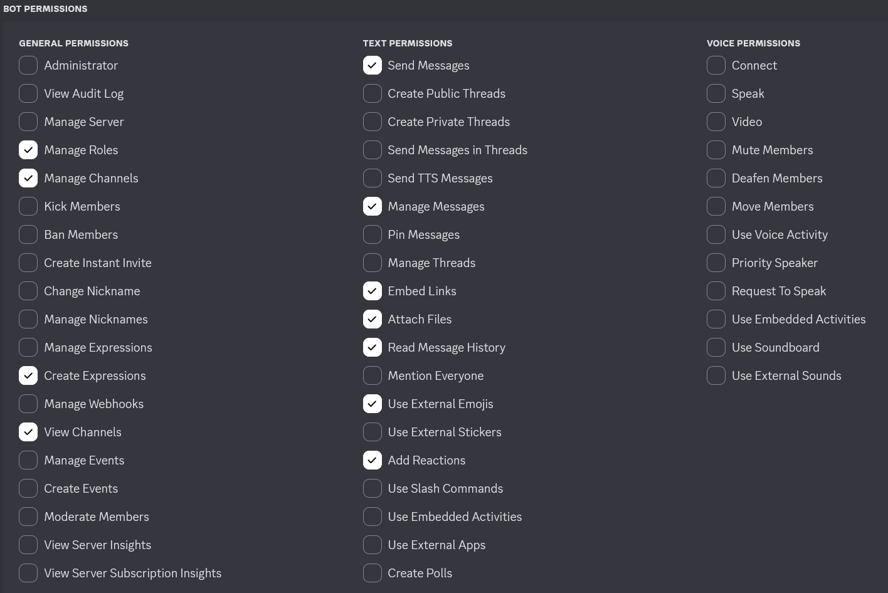

# RomM-ComM (RomM Communicator Module)


A Discord bot that integrates with the [RomM](https://github.com/rommapp/romm) API to provide information about your ROM collection, handle user ROM requests, and control RomM from Discord.

**Disclaimer:** This was primarily created using Claude Code after my project scope outpaced my programming ability.
---

<p align="center">
  
</p>

---

## Table of Contents

- [Features](#features)
- [Requirements](#requirements)
- [Installation](#installation)
- [Discord Bot Token Creation](#discord-bot-token-creation)
- [RomM Settings](#romm-settings)
- [Configuration](#configuration)
- [Recently Added Game Notifications](#recently-added-game-notifications)
- [Visible Statistics](#visible-statistics)
- [Emojis](#emojis)
- [Available Commands](#available-commands)
- [Requests](#requests)
- [User Manager](#user-manager)
- [Error Handling](#error-handling)
- [Security](#security)
- [Troubleshooting](#troubleshooting)
- [Contributing](#contributing)

---

## Features

### Current

- **Recently Added**: Posts recently added ROM updates to a configured channel (batched when multiple ROMs are added).
- **Request system**: Submit and manage ROM requests entirely from Discord. Requests are enriched with IGDB metadata when available. Optional [GGRequestz](https://github.com/XTREEMMAK/ggrequestz) integration. 
- **Search**: Platform-specific searches and a random ROM roll. Results include metadata and download links.
- **Stats**: Near real-time collection statistics shown in voice channel names, the bot "Now Playing" status, and via commands.
- **Multi-file support**: Searches support multi-file games; users can select one, several, or all files to download.
- **Firmware search**: Lists firmware files for a platform with names, sizes, hashes, and download links.
- **Scans**: Start/stop/status for different RomM scan types. The bot reports progress and a summary on completion.
- **Emojis**: Uploads custom console emojis on install; uses emojis in responses and stats. Nitro-aware to expand/revert the emoji set.
- **QR code generation**: Generate QR codes for 3DS/Vita [FBI Reloaded](https://github.com/TheRealZora/FBI-Reloaded)/[VitaShell](https://github.com/RealYoti/VitaShell) installs by reacting to /search replies with QR emoji (requires download endpoint auth to be disabled on the RomM instance).
- **RomM user management**: Auto-create RomM accounts for Discord users via role assignment; manage Romm > Discord user linking via gui in Discord.
- **Switch Shop info**: Command to display instructions for connecting to a [Tinfoil](https://tinfoil.io/Download) endpoint (download endpoint auth must be disabled).
- **Rate-limited Discord interactions**: Built-in rate limiting to avoid overloading the Discord API.

### Planned

- Alternative chat client integrations: Matrix, Telegram, Slack (no ETA).

---

## Requirements

- Python 3.12+
- Python dependancies (see non-Docker installation below)

---

## Installation

### Docker

1. `docker pull idiosync000/romm-comm:latest`
2. Pass the environment variables (see [Configuration](#configuration)).
3. Mount `/app/data` to a host directory — this stores the user/request DB and emoji sync status.

### Non-Docker (local)

1. Clone the repository or download the source code.
2. Install dependencies:

```bash
pip install py-cord aiohttp python-dotenv qrcode Pillow python-socketio requests aiosqlite python-dateutil
```

---

## Discord Bot Token Creation

- See the Pycord docs for bot creation and permission setup: https://docs.pycord.dev/en/stable/discord.html
- Enable **Privileged Gateway Intents** in the bot settings.

### Permissions
<p align="center">
  
</p>

---

## RomM Settings

If you want downloads to work without requiring users to log in (including Switch shop / QR code console installs), set the following on your RomM server environment:

```env
DISABLE_DOWNLOAD_ENDPOINT_AUTH=true
```

Setting this disables authentication for the download endpoint. If not set (or set to `false`), users must be logged in to RomM to download files.

---

## Configuration

Create a `.env` file in the project root with the following variables.

```env
# Required
TOKEN=your_discord_bot_token
GUILD=your_guild_id
API_URL=http://your_romm_host:port
USER=api_username
PASS=api_password

# Optional
ADMIN_ID=admin_user_id
DOMAIN=your_website_domain
REQUESTS_ENABLED=true
IGDB_CLIENT_ID=your_client_id
IGDB_CLIENT_SECRET=your_client_secret
AUTO_REGISTER_ROLE_ID=romm_users_role_id
UPDATE_VOICE_NAMES=true
CHANNEL_ID=your_channel_id
RECENT_ROMS_ENABLED=true
RECENT_ROMS_CHANNEL_ID=your_channel_id
RECENT_ROMS_MAX_PER_POST=10
RECENT_ROMS_BULK_THRESHOLD=25
GGREQUESTZ_ENABLED=false
GGREQUESTZ_URL=http://ip:port
GGREQUESTZ_API_KEY=ggr_api_key

```

### Configuration details

**Required:**
- `TOKEN` — Discord bot token.
- `GUILD` — Discord server (guild) ID.
- `API_URL` — Base URL for your RomM instance (use `http://ip:port` or a domain).
- `USER` / `PASS` — API credentials for RomM.

**Common optional settings (defaults shown where applicable):**
- `ADMIN_ID` — User OR role ID allowed to run admin commands (scan, sync users, etc.).
- `DOMAIN` — Public domain for download links (default: `No website configured`).
- `SYNC_RATE` — How often to sync with the API in seconds (default: `3600`).
- `UPDATE_VOICE_NAMES` — Enable voice channel stats (default: `true`).
- `REQUESTS_ENABLED` — Enable request commands (default: `true`).
- `IGDB_CLIENT_ID`, `IGDB_CLIENT_SECRET` — For request metadata (can be shared with RomM).
- `AUTO_REGISTER_ROLE_ID` — Role that triggers automatic RomM invite link DMs to users.
- `CHANNEL_ID` — Channel for sync results and user manager logs.
- `RECENT_ROMS_*` — Controls for recent-ROM posting (enabled, channel id, thresholds).
- `GGREQUESTZ_ENABLED` — Enable GGrrequestz for request managmenet (default: false).
- `GGREQUESTZ_URL` — Base URL for your GGRequestz instance (use `http://ip:port` or a domain).
- `GGREQUESTZ_API_KEY`  — Your GGRequestz API key (properly scoped).

---

## Available Commands

- `/search [platform] [game]` — Search ROMs with interactive results and optional QR code for console installs. 
- `/request`, `/my_requests`, `/request_admin` — Submit, view, and manage requests.
- `/random [platform]` — Fetch a random ROM (platform optional).
- `/firmware [platform]` — List firmware files with hash details and download links.
- `/scan [option]` — Run or check scans (admin only): `full`, `platform`, `stop`, `status`, `unidentified`, `hashes`, `new_platforms`, `partial`, `summary`.
- `/platforms` — Display all available platforms with their ROM counts.
- `/igdb [option]` — View list of games from IGDB: `upcoming`, `recent`, `popular`, or `exclusive`, generally or by platform with option to request.
- `/user_manager` — Manage Romm and Discord users (linking, new account prompting, etc.) (admin only).
- `/refresh_recent_metadata` — Refresh recently added game notifiction metadata/covers (admin only).

---

## Recently Added Game Notifications


- When enabled (`RECENT_ROMS_ENABLED=true`) the bot posts newly added games to the configured channel.
- If multiple games added from a scan, the notification shows a list of games grouped into a single response sorted by platform.
- `/refresh_recent_metadata [count: n]` where n is the number of messages you want to go back and refresh, from the most recent. Default is 1, which is the most recently posted notification.
- If only text is changed, the notification is edited. If covers change, the original message is deleted and a new message is posted with the new cover. This due to a Discord file attachment limitation.

---

## Visible Statistics

### Voice channel stats


When enabled (`UPDATE_VOICE_NAMES=true`) the bot creates voice channels to display:
- Platform counts
- ROM count
- Save and save-state counts
- Screenshot count
- RomM user count
- Storage usage

Voice channel names are only updated when the underlying stat changes. The bot will create new channels and delete old ones to avoid duplicates.

### Bot status


The bot updates its "Now Playing" / status with the total ROM count whenever it refreshes API data.

---

## Emojis


- On first boot or when joining a server, the bot uploads a standard set of custom console emojis (default ~50).
- If the server has boosted Nitro/extra emoji slots available, the bot can upload an extended emoji set; if Nitro is later removed the bot reverts to the standard list to preserve the most-used emojis.
- Emojis are used throughout bot responses to visually identify platforms when a matching emoji exists on the server. The extended emoji set covers less popular consoles as well as variants.
- The bot has an even more extended list of emojis that it uploads to itself which are only usable in bot replies. This consists of every emoji on teh previous two lists plus logos and more obscure console emojis.
- If you want to delete the emojis uploaded to the server (usable by users) you can, emojis used in bot responses will not be affected and the server emoji sync is tracked so they will not be reuploaded. 

---

## Requests


**User features:**
- Submit requests with platform, game name, and optional details.
- Platforms match to IGDB, attempts IGDB matching for fetching metadata. 
- Non-matching requests will still go through for things like rom hacks or unrealeased games, just without metadata.
- Detect existing ROMs in Romm to avoid unnecissary requests and brings up /search results automatically if found.
- DMs requester notification when requests are avalable.
- Handles duplicate requests, additional requesters will also be notified if game is added. 
- Per user request cap (currently 25 pending each).
- Requests can be filled automatically during Romm filesystem scan or manually by admin.

**Admin features:**
- View, filter, and manage pending requests.
- Manually mark as fulfilled, reject or add notes.
- Requester's Discord avatar is present in the request embed as the thumbnail.

**GGRequestz Integration**
- If enabled, requests get sent to [GGRequestz](https://github.com/XTREEMMAK/ggrequestz) for management.
- Requests that are detected during a scan are automatically marked as fulfilled in GGRequestz and users are notified in Discord.
- Manual fulfillments and rejections made in Discord are synced to GGRequestz, users are notified in Discord.
- Requests fulfilled or rejected in GGRequestz are synced to Discord when an admin runs /request_admin or a user runs /my_requests, request status is always accurate when checked. 
- Requests in GGRequestz are only synced back to Discord if they originated from a Discord user. 
- Requests in GGRequestz from Discord are "Requested By" the GGRequestz user that you login as in the bot env variables, Discord user is listed in request details. 

Add the below variables to your .env to enable:
```
GGREQUESTZ_ENABLED=true
GGREQUESTZ_URL=http://ip:port
GGREQUESTZ_API_KEY=ggr_api_key
```
---

## User Manager


- `/manage_users` — Manage Romm and Discord users (admin only).
- Discord users can be linked to Romm users, entries in dropdown show if a user is linked or not (and to what user names).
- Linking is useful for keeping track of who on the server has a Romm account, also for enriching request information in the request manager.
- Unlinking accounts deletes or disables (or just unlinks) Romm user from server (unless user is an admin).
- Select Discord user and hit 'Send Invite' button to manually onboard user to Romm via DM (see Onboarding via role).

**Onboarding via role:**
- Sends RomM invite links automatically when specified role is added to Discord user.
- Uses Discord display name + suffixes, generates a random password and DMs the user their login info.
- Deletes or disables RomM accounts created by the bot when the role is removed (or just unlinks), skips admin accounts.

---

## Error Handling

- Handles API connectivity issues, rate limits, data validation, and caching errors.
- Logs are descriptive but avoid exposing sensitive info.

---

## Security

- Uses OAuth2 bearer tokens for RomM API.
- Secrets configured in environment variables.
- No password logging.
- Strict permission checks for admin commands.

---

## Troubleshooting

- Verify the Discord bot token and permissions.
- Check API connectivity (`API_URL`).
- Review logs for issues.
- Confirm `.env` configuration.

---

## Contributing

Contributions are welcome. Open issues or PRs with clear descriptions, logs, and reproduction steps.

---


